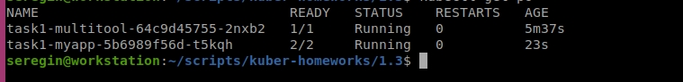
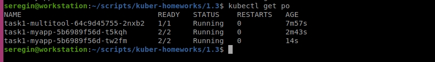
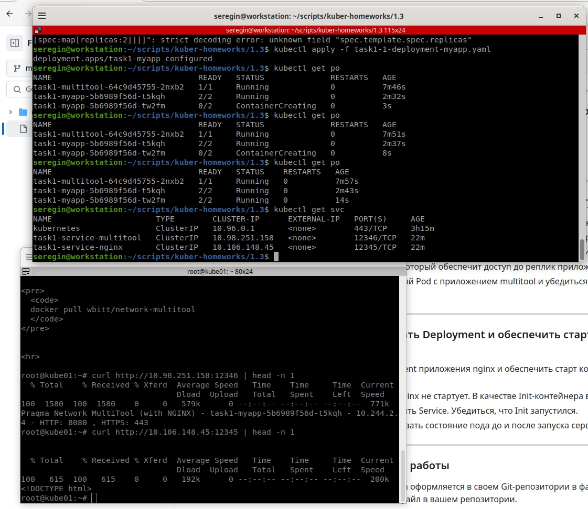
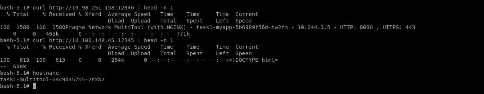

# Домашнее задание к занятию «Запуск приложений в K8S»

### Цель задания

В тестовой среде для работы с Kubernetes, установленной в предыдущем ДЗ, необходимо развернуть Deployment с приложением, состоящим из нескольких контейнеров, и масштабировать его.

------

### Чеклист готовности к домашнему заданию

1. Установленное k8s-решение (например, MicroK8S).
2. Установленный локальный kubectl.
3. Редактор YAML-файлов с подключённым git-репозиторием.

------

### Инструменты и дополнительные материалы, которые пригодятся для выполнения задания

1. [Описание](https://kubernetes.io/docs/concepts/workloads/controllers/deployment/) Deployment и примеры манифестов.
2. [Описание](https://kubernetes.io/docs/concepts/workloads/pods/init-containers/) Init-контейнеров.
3. [Описание](https://github.com/wbitt/Network-MultiTool) Multitool.

------

### Задание 1. Создать Deployment и обеспечить доступ к репликам приложения из другого Pod

> 1. Создать Deployment приложения, состоящего из двух контейнеров — nginx и multitool. Решить возникшую ошибку.

В целом возник целый ряд ошибок:

- `конфликт портов приложений` - унес multitool на 8080
- `в рамках одного пода нет возможности сделать 2 сервиса` - сделал 2 отдельных, на nginx и на multitool
- `указанный на вебинаре 1.2 praqma/network-multitool:alpine-extra не работает` - пришлось посетить docker hub и скорректировать до `praqma/network-multitool`

https://github.com/WilderWein123/kuber-homeworks-1.3/blob/master/task1-1-deployment-multitool.yaml

2. После запуска увеличить количество реплик работающего приложения до 2.

> 3. Продемонстрировать количество подов до и после масштабирования.

До:

После:

> 4. Создать Service, который обеспечит доступ до реплик приложений из п.1.

Как уже написал выше, создать сервис до одного приложения не получится. Поэтому создаем два - на порту 12345 и 12346. 

https://github.com/WilderWein123/kuber-homeworks-1.3/blob/master/task1-service-multitool.yaml

https://github.com/WilderWein123/kuber-homeworks-1.3/blob/master/task1-service-nginx.yaml

И проверяем:

> 5. Создать отдельный Pod с приложением multitool и убедиться с помощью `curl`, что из пода есть доступ до приложений из п.1.

Проваливаемся внутрь пода `kubectl exec -it` и проверяем курлом:

https://github.com/WilderWein123/kuber-homeworks-1.3/blob/master/task1-1-deployment-multitool.yaml

------

### Задание 2. Создать Deployment и обеспечить старт основного контейнера при выполнении условий

1. Создать Deployment приложения nginx и обеспечить старт контейнера только после того, как будет запущен сервис этого приложения.
2. Убедиться, что nginx не стартует. В качестве Init-контейнера взять busybox.
3. Создать и запустить Service. Убедиться, что Init запустился.
4. Продемонстрировать состояние пода до и после запуска сервиса.

------

### Правила приема работы

1. Домашняя работа оформляется в своем Git-репозитории в файле README.md. Выполненное домашнее задание пришлите ссылкой на .md-файл в вашем репозитории.
2. Файл README.md должен содержать скриншоты вывода необходимых команд `kubectl` и скриншоты результатов.
3. Репозиторий должен содержать файлы манифестов и ссылки на них в файле README.md.

------
